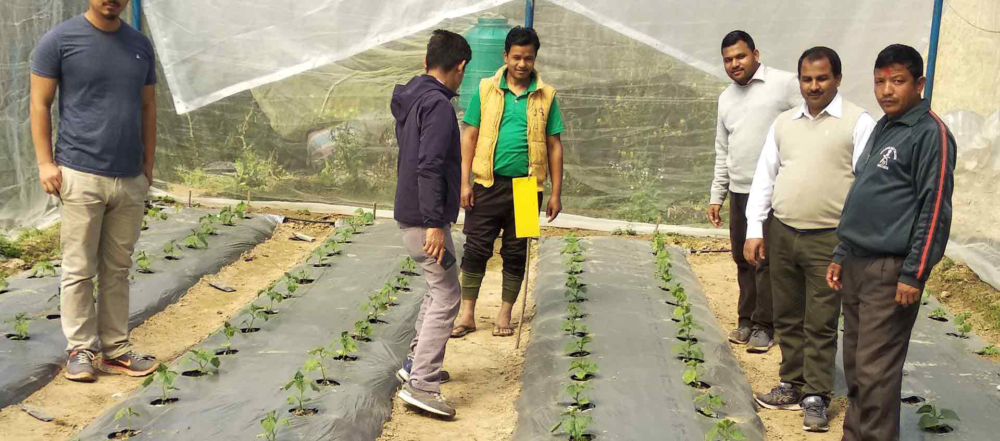

<div align="center">


# RISMFP UI

A responsive reconstruction of the historical **Raising Incomes of Small and Medium Farmers Project** website.

[](https://nischhalsubba.github.io/rismfp-ui/)
[](https://github.com/Nischhalsubba/rismfp-ui/actions/workflows/quality.yml)
[](./package.json)
[](./LICENSE)

[View the site](https://nischhalsubba.github.io/rismfp-ui/) · [Browse the source](./index.html) · [Run locally](#run-locally) · [Review the architecture](#architecture)

</div>



> [!IMPORTANT]
> This is an independent frontend case study and historical interface archive. It is not an official Government of Nepal, RISMFP, or Asian Development Bank service.

## Contents

- [Overview](#overview)
- [Experience](#experience)
- [Pages](#pages)
- [Architecture](#architecture)
- [Design system](#design-system)
- [Interactions](#interactions)
- [Accessibility](#accessibility)
- [Run locally](#run-locally)
- [Quality checks](#quality-checks)
- [Deployment](#deployment)
- [Historical content](#historical-content)

## Overview

The repository started in 2019 as a frontend exercise built with Bootstrap, jQuery, Gulp, Sass, Owl Carousel, and Scroll-Out. The current implementation preserves the original project identity and selected field photography while replacing the old stack with readable HTML, CSS, and JavaScript that publish directly through GitHub Pages.

The rebuild has three goals:

1. Preserve useful historical project material and original assets.
2. Make programme information, notices, and reports easier to navigate.
3. Keep the implementation understandable without a framework or build pipeline.

## Experience

| Area | Implementation |
|---|---|
| Homepage | Split editorial hero, original field image, historical metric cards, and asymmetric navigation panels |
| Project pages | Image-led page introductions and long-form editorial content layouts |
| Web MIS | Structured process cards, system capabilities, and an information-flow sequence |
| News and reports | Search, category filters, live result counts, empty states, and clear unavailable-file labels |
| Contact | Historical office cards with a prominent verification warning |
| Shared interface | Responsive header and footer rendered with native Web Components |
| Hosting | Repository-relative routes and `.nojekyll` for direct GitHub Pages deployment |

## Pages

| Page | Purpose |
|---|---|
| [`index.html`](./index.html) | Project entry point, historical figures, archive pathways, and original field imagery |
| [`introduction.html`](./introduction.html) | Programme context, farmer constraints, project approach, beneficiaries, and intended outcomes |
| [`web-based-mis.html`](./web-based-mis.html) | Monitoring, evaluation, reporting, and knowledge-management overview |
| [`news.html`](./news.html) | Searchable archive of retained historical notices |
| [`download.html`](./download.html) | Searchable archive of report, form, and manual titles |
| [`contact.html`](./contact.html) | Historical office details with explicit archive warnings |
| [`404.html`](./404.html) | Custom missing-page response and recovery route |

## Architecture

```text
.
├── .github/
│   └── workflows/quality.yml
├── assets/
│   ├── css/
│   │   ├── style.css
│   │   └── agri-theme.css
│   ├── images/
│   │   ├── logo.svg
│   │   └── selected original project photographs
│   └── js/
│       └── app.js
├── scripts/
│   └── validate.mjs
├── 404.html
├── contact.html
├── download.html
├── index.html
├── introduction.html
├── news.html
├── web-based-mis.html
├── package.json
└── README.md
```

<details>
<summary><strong>Why native Web Components?</strong></summary>

The header and footer appear on every page. Defining them once in `assets/js/app.js` avoids copying large navigation blocks while preserving direct static hosting. The page content itself remains ordinary semantic HTML.

</details>

<details>
<summary><strong>Why keep the site framework-free?</strong></summary>

The project consists of a focused set of content pages and lightweight interactions. A framework would add installation, bundling, dependency updates, and deployment complexity without improving the visitor experience.

</details>

## Design system

The interface uses a contemporary agricultural editorial system built around original project photography and historical information.

| Token | Role |
|---|---|
| Deep forest green | Navigation state, primary actions, metrics, process flows, and footer |
| Warm cream | Main page canvas and quieter content areas |
| Lime | High-emphasis panels, metrics, and calls to action |
| Soft mint | Supporting cards, tags, and low-emphasis states |
| Amber | Small visual markers and focus treatment |
| Manrope | Headings, navigation, body copy, controls, and statistics |

The typeface is loaded from Google Fonts with a system sans-serif fallback. Layouts use large but controlled headings, generous section spacing, asymmetric card proportions, and rounded image containers. All important content remains readable if the font request fails.

## Interactions

### Responsive navigation

The shared header exposes a menu button on smaller screens. The button updates `aria-expanded`, controls the navigation state, closes after route selection, and supports the Escape key.

### Archive filtering

The news and reports pages include:

- text search;
- category filtering;
- live result counts;
- a dedicated empty state;
- content that remains present when JavaScript is unavailable.

### Reveal motion

Selected homepage sections use Intersection Observer for subtle entrance motion. Visitors using `prefers-reduced-motion` receive the content immediately without animation.

## Accessibility

The implementation includes:

- one page-level `<h1>` per document;
- semantic page landmarks;
- keyboard-accessible navigation and controls;
- a skip link;
- visible focus treatment;
- descriptive image alternative text;
- `aria-current` for active navigation;
- live archive result counts;
- responsive layouts without intentional horizontal scrolling;
- reduced-motion handling.

## Run locally

No package installation is required.

```bash
python -m http.server 8000
```

Open [http://localhost:8000](http://localhost:8000).

Convenience commands are also available:

```bash
npm run serve
npm run check
```

## Quality checks

The repository includes a dependency-free validator and GitHub Actions workflow.

```bash
npm run check
```

The checks cover JavaScript syntax, required metadata, document landmarks, structural comments, local references, image alternative text, placeholder URLs, inline styles, readable source formatting, and JavaScript function documentation.

## Deployment

The site publishes from the repository root and uses relative page and asset paths so it works under the `/rismfp-ui/` GitHub Pages project path.

1. Open repository **Settings**.
2. Choose **Pages**.
3. Select **Deploy from a branch**.
4. Select `master` and `/ (root)`.
5. Save the configuration.

The `.nojekyll` file prevents Jekyll processing.

## Historical content

Names, figures, notices, office details, and project descriptions come from the earlier repository and may be outdated. Missing report files are labelled unavailable rather than linked to placeholder downloads.

The original RISMFP logo and selected project photographs are retained for historical and case-study context. They are not covered by the MIT licence granted to the frontend source code.

## License

The frontend code is available under the [MIT License](./LICENSE). Historical logos, photographs, names, and project material remain attributable to their original owners.
