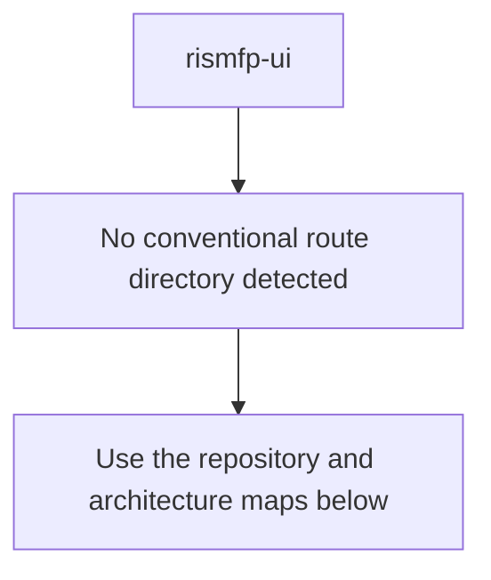
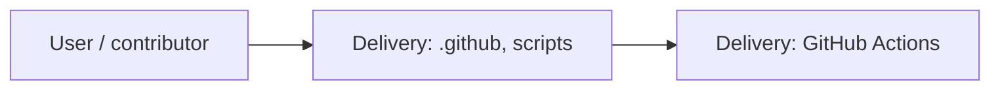
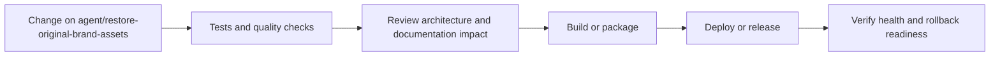
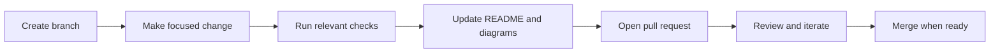

<!-- interactive-readme-standard:start -->

<div align="center">

# rismfp-ui

**Branch-aware technical guide for [`agent/restore-original-brand-assets`](https://github.com/Nischhalsubba/rismfp-ui/tree/agent/restore-original-brand-assets)**

<p>     </p>

<p>
  <a href="https://github.com/Nischhalsubba/rismfp-ui/tree/agent/restore-original-brand-assets"><strong>Browse source</strong></a> ·
  <a href="https://github.com/Nischhalsubba/rismfp-ui/issues"><strong>Issues</strong></a> ·
  <a href="https://github.com/Nischhalsubba/rismfp-ui/codespaces/new?ref=agent%2Frestore-original-brand-assets"><strong>Open in Codespaces</strong></a>
</p>

</div>

> [!IMPORTANT]
> This guide is generated from the files actually present on `agent/restore-original-brand-assets`. It links to detected source paths, preserves project-authored notes, and avoids claiming components that were not found.

## At a glance

| Item | Detected value |
|---|---|
| Purpose | Static historical interface for the Raising Incomes of Small and Medium Farmers Project. |
| Branch role | Compared with `master` |
| Stack | HTML, JavaScript, CSS |
| Manifests | package.json |
| Prerequisites | Node.js |
| Delivery | GitHub Actions |
| License | LICENSE |

## Branch scope

This branch differs from the default branch in the following detected paths:

- [`README.md`](https://github.com/Nischhalsubba/rismfp-ui/blob/agent/restore-original-brand-assets/README.md)

## Quick start

```bash
npm install
```

### Configuration surface

- No committed environment example file was detected.

> Never commit secrets, private keys, production credentials, customer data, or unredacted infrastructure details.

## Repository map


```mermaid
flowchart TD
    ROOT["rismfp-ui / agent/restore-original-brand-assets"]
    ROOT --> P0[".github/"]
    ROOT --> P1["assets/"]
    ROOT --> P2["scripts/"]
    ROOT --> P3[".nojekyll"]
    ROOT --> P4["404.html"]
    ROOT --> P5["contact.html"]
    ROOT --> P6["download.html"]
    ROOT --> P7["index.html"]
    ROOT --> P8["introduction.html"]
    ROOT --> P9["LICENSE"]
    ROOT --> P10["llms.txt"]
    ROOT --> P11["news.html"]
    ROOT --> P12["package.json"]
    ROOT --> P13["robots.txt"]
    ROOT --> P14["site.webmanifest"]
    ROOT --> P15["web-based-mis.html"]
```

| Responsibility | Detected source paths |
|---|---|
| Delivery | [`.github`](https://github.com/Nischhalsubba/rismfp-ui/tree/agent/restore-original-brand-assets/.github), [`scripts`](https://github.com/Nischhalsubba/rismfp-ui/tree/agent/restore-original-brand-assets/scripts) |

## Website or application map


```mermaid
flowchart TD
    APP["rismfp-ui"]
    APP --> SOURCE["No conventional route directory detected"]
    SOURCE --> GUIDE["Use the repository and architecture maps below"]
```

## Architecture and responsibility flow


```mermaid
flowchart LR
    USER["User / contributor"]
    USER --> A0["Delivery: .github, scripts"]
    A0 --> DELIVERY["Delivery: GitHub Actions"]
```


## Quality, security, and operations

<table>
<tr>
<td width="33%" valign="top">

### Quality

- No conventional test directory was detected automatically.

Detected commands:
- No standard quality command detected.

</td>
<td width="33%" valign="top">

### Security

- No dedicated security policy or automated dependency configuration was detected.

Review authentication, authorization, input validation, dependency updates, secret handling, and failure recovery before release.

</td>
<td width="34%" valign="top">

### Observability

- No dedicated observability integration was detected automatically.

Define useful logs, metrics, traces, alerts, and rollback signals for production-facing branches.

</td>
</tr>
</table>

## Delivery flow


```mermaid
flowchart LR
    CHANGE["Change on agent/restore-original-brand-assets"] --> CHECK["Tests and quality checks"]
    CHECK --> REVIEW["Review architecture and documentation impact"]
    REVIEW --> BUILD["Build or package"]
    BUILD --> DEPLOY["Deploy or release"]
    DEPLOY --> VERIFY["Verify health and rollback readiness"]
```

### Automation detected

- [`.github/workflows/quality.yml`](https://github.com/Nischhalsubba/rismfp-ui/blob/agent/restore-original-brand-assets/.github/workflows/quality.yml)

## Contribution flow


```mermaid
flowchart LR
    FORK["Create branch"] --> CHANGE["Make focused change"]
    CHANGE --> TEST["Run relevant checks"]
    TEST --> DOCS["Update README and diagrams"]
    DOCS --> PR["Open pull request"]
    PR --> REVIEW["Review and iterate"]
    REVIEW --> MERGE["Merge when ready"]
```

- Keep changes focused and explain architectural consequences.
- Run the checks relevant to the changed area.
- Update diagrams whenever routes, modules, data models, authentication, jobs, or delivery paths change.
- Add screenshots or recordings for visual behavior changes when useful.
- Use issues for reproducible defects and pull requests for reviewable changes.

## Ownership and support

| Topic | Source |
|---|---|
| Repository | [`Nischhalsubba/rismfp-ui`](https://github.com/Nischhalsubba/rismfp-ui) |
| Branch | [`agent/restore-original-brand-assets`](https://github.com/Nischhalsubba/rismfp-ui/tree/agent/restore-original-brand-assets) |
| Ownership | No CODEOWNERS file detected |
| Contributing | Use the contribution flow above |
| Support | [Open or review issues](https://github.com/Nischhalsubba/rismfp-ui/issues) |
| License | [`LICENSE`](https://github.com/Nischhalsubba/rismfp-ui/blob/agent/restore-original-brand-assets/LICENSE) |

<details>
<summary><strong>Documentation maintenance checklist</strong></summary>

- [ ] Purpose and branch scope are accurate.
- [ ] Setup and configuration commands still work.
- [ ] Repository, application, API, data, authentication, job, and deployment diagrams match the code.
- [ ] Tests, security controls, observability, and rollback behavior are documented.
- [ ] Links point to real files on this branch.
- [ ] No secrets or private operational details are exposed.

</details>

<!-- interactive-readme-standard:end -->

<!-- project-authored-notes:start -->
<details>
<summary><strong>Project-authored notes preserved from this branch</strong></summary>

# RISMFP UI

A static rebuild of the historical Raising Incomes of Small and Medium Farmers Project website.

The repository began as a 2019 frontend exercise using Bootstrap, jQuery, Gulp, Sass, Owl Carousel, and Scroll-Out. The current version keeps the project material and selected original assets while replacing the old implementation with plain HTML, CSS, and JavaScript that can be hosted directly on GitHub Pages.

> This is an independent frontend case study. It is not an official Government of Nepal, RISMFP, or Asian Development Bank service.

## What is included

- responsive pages for the project overview, web MIS, news, reports, and historical contact details;
- the original RISMFP logo and selected field photographs from the earlier repository;
- shared header and footer Web Components;
- client-side search and category filters for archived notices and reports;
- keyboard navigation, visible focus styles, semantic landmarks, and reduced-motion support;
- no build step and no runtime dependency.

## Project structure

```text
.
├── index.html
├── introduction.html
├── web-based-mis.html
├── news.html
├── download.html
├── contact.html
├── 404.html
└── assets
    ├── css/style.css
    ├── images/
    └── js/app.js
```

## Run locally

The site does not require package installation.

```bash
python -m http.server 8000
```

Open `http://localhost:8000` in a browser.

## Code comments

The HTML files include comments for the document structure and each major content section. The JavaScript file includes documentation for every function, method, and component. The CSS file is divided into labelled sections so future changes can be found without searching through compressed output.

Comments explain intent and behaviour rather than repeating obvious syntax. This keeps the source readable without filling every wrapper element with noise.

## GitHub Pages

The site is designed to publish from the repository root. Relative URLs are used for pages and assets so it works under the `/rismfp-ui/` project path.

## Historical content

Names, figures, notices, office details, and project descriptions come from the earlier repository and may be outdated. Missing report files are labelled unavailable rather than linked to placeholder URLs.

## License

The frontend code is available under the MIT License. Historical logos, photographs, names, and project material remain attributable to their original owners and are included for archival and case-study context.

</details>
<!-- project-authored-notes:end -->
