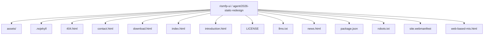
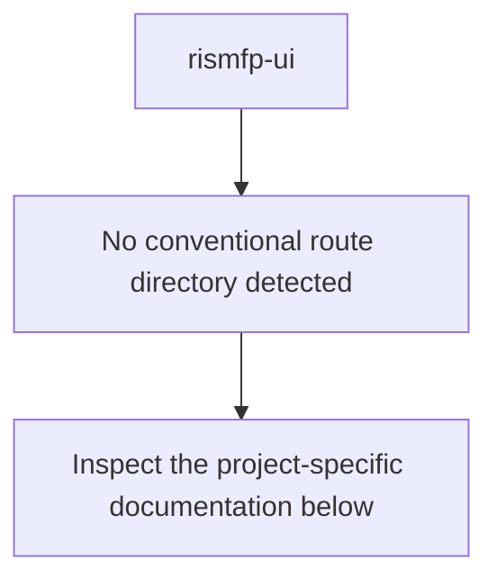
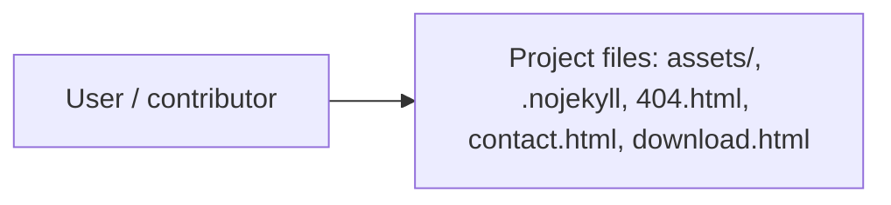
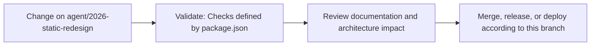

# RISMFP UI · 2026 redesign

<!-- interactive-readme-standard:start -->

> [!NOTE]
> **Branch-specific documentation:** this section is maintained for [`agent/2026-static-redesign`](https://github.com/Nischhalsubba/rismfp-ui/tree/agent/2026-static-redesign). It is generated from the files present on this branch and preserves the project-authored README below.

<details open>
<summary><strong>Interactive repository guide</strong></summary>

## Branch overview

| Item | Value |
|---|---|
| Repository | [`Nischhalsubba/rismfp-ui`](https://github.com/Nischhalsubba/rismfp-ui) |
| Branch | [`agent/2026-static-redesign`](https://github.com/Nischhalsubba/rismfp-ui/tree/agent/2026-static-redesign) |
| Detected stack | HTML, CSS, JavaScript |
| Detected manifests | package.json |
| Documentation policy | Every maintained branch must explain purpose, setup, structure, architecture, flows, testing, delivery, security, and ownership. |

## Repository structure


```mermaid
flowchart TD
    ROOT["rismfp-ui / agent/2026-static-redesign"]
    ROOT --> P0["assets/"]
    ROOT --> P1[".nojekyll"]
    ROOT --> P2["404.html"]
    ROOT --> P3["contact.html"]
    ROOT --> P4["download.html"]
    ROOT --> P5["index.html"]
    ROOT --> P6["introduction.html"]
    ROOT --> P7["LICENSE"]
    ROOT --> P8["llms.txt"]
    ROOT --> P9["news.html"]
    ROOT --> P10["package.json"]
    ROOT --> P11["robots.txt"]
    ROOT --> P12["site.webmanifest"]
    ROOT --> P13["web-based-mis.html"]
```

The diagram is generated from the branch's actual top-level files and directories. Use the branch link above for complete source navigation.

## Website or application structure


```mermaid
flowchart TD
    APP["rismfp-ui"]
    APP --> SOURCE["No conventional route directory detected"]
    SOURCE --> VERIFY["Inspect the project-specific documentation below"]
```

## Application and responsibility flow


```mermaid
flowchart LR
    ACTOR["User / contributor"]
    ACTOR --> A0["Project files: assets/, .nojekyll, 404.html, contact.html, download.html"]
```

## Change-to-delivery flow


```mermaid
flowchart LR
    CHANGE["Change on agent/2026-static-redesign"]
    CHECK["Validate: Checks defined by package.json"]
    REVIEW["Review documentation and architecture impact"]
    RELEASE["Merge, release, or deploy according to this branch"]
    CHANGE --> CHECK --> REVIEW --> RELEASE
```

## README requirements for this branch

- Explain what this branch contains and how it differs from the default branch.
- Keep installation, configuration, usage, testing, deployment, security, support, and license information accurate.
- Document repository, website or application, API, data, authentication, background-job, and deployment flows when they exist.
- Prefer Mermaid diagrams and expandable `<details>` sections for visual navigation.
- Link diagrams and modules to real source paths; never invent missing components.
- Preserve project-specific documentation and update diagrams whenever architecture or major paths change.
- Treat secrets, private infrastructure, customer data, and credentials as prohibited README content.

</details>

<!-- interactive-readme-standard:end -->

A dependency-free, accessible static redesign of the historical **Raising Incomes of Small and Medium Farmers Project (RISMFP)** website.

> This repository is an independent portfolio and frontend demonstration. It is not an official Government of Nepal, RISMFP, or Asian Development Bank service.

## What changed

- Replaced Bootstrap 4, jQuery, Gulp, Owl Carousel, Scroll-Out, Font Awesome, and legacy SCSS output.
- Rebuilt every public page with semantic HTML, modern CSS, and a small ES module.
- Added responsive navigation, archive search/filtering, honest unavailable-document states, accessible focus styles, reduced-motion support, and a custom 404 page.
- Preserved historical content while clearly separating it from current or official information.
- Kept deployment fully compatible with GitHub Pages.

## Architecture

```text
.
├── index.html
├── introduction.html
├── web-based-mis.html
├── news.html
├── download.html
├── contact.html
├── 404.html
└── assets
    ├── css/style.css
    └── js/app.js
```

The site uses native Web Components for the shared header and footer. Pages remain readable if JavaScript fails; filtering and mobile navigation are progressive enhancements.

## Local development

No build step is required.

```bash
python -m http.server 8000
```

Open `http://localhost:8000`.

## Deployment

GitHub Pages can publish directly from the repository root. The `.nojekyll` file prevents Jekyll processing.

## Design direction

The interface combines public-service clarity with a contemporary editorial system:

- dark agricultural green, warm neutral surfaces, and a restrained lime accent
- Manrope display typography with DM Sans body copy
- content-first hierarchy and generous spacing
- explicit archive/disclaimer messaging
- WCAG-conscious contrast, focus, semantics, and motion

## License

MIT for the code in this repository. Historical names and content remain attributable to their original organisations and are included only for archival design context.
