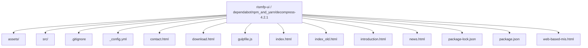
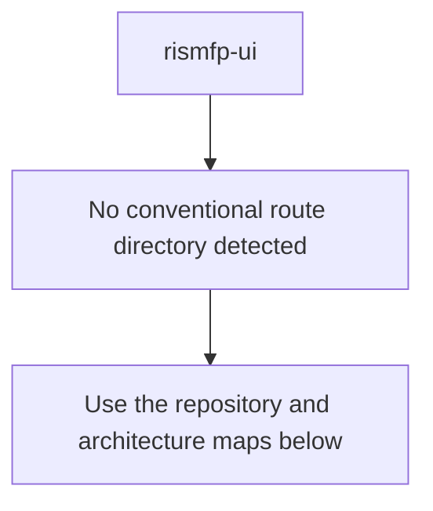
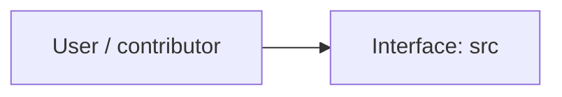
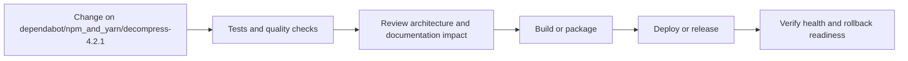
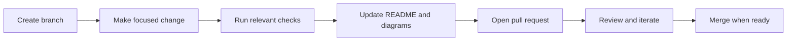

<!-- interactive-readme-standard:start -->

<div align="center">

# rismfp-ui

**Branch-aware technical guide for [`dependabot/npm_and_yarn/decompress-4.2.1`](https://github.com/Nischhalsubba/rismfp-ui/tree/dependabot/npm_and_yarn/decompress-4.2.1)**

<p>     </p>

<p>
  <a href="https://github.com/Nischhalsubba/rismfp-ui/tree/dependabot/npm_and_yarn/decompress-4.2.1"><strong>Browse source</strong></a> ·
  <a href="https://github.com/Nischhalsubba/rismfp-ui/issues"><strong>Issues</strong></a> ·
  <a href="https://github.com/Nischhalsubba/rismfp-ui/codespaces/new?ref=dependabot%2Fnpm_and_yarn%2Fdecompress-4.2.1"><strong>Open in Codespaces</strong></a>
</p>

</div>

> [!IMPORTANT]
> This guide is generated from the files actually present on `dependabot/npm_and_yarn/decompress-4.2.1`. It links to detected source paths, preserves project-authored notes, and avoids claiming components that were not found.

## At a glance

| Item | Detected value |
|---|---|
| Purpose | A Sass project documented from the current branch structure and manifests. |
| Branch role | Compared with `master` |
| Stack | Sass, JavaScript, HTML, CSS |
| Manifests | package.json |
| Prerequisites | Node.js |
| Delivery | No conventional deployment configuration detected |
| License | No license file detected |

## Branch scope

This branch differs from the default branch in the following detected paths:

- [`README.md`](https://github.com/Nischhalsubba/rismfp-ui/blob/dependabot/npm_and_yarn/decompress-4.2.1/README.md)
- [`package-lock.json`](https://github.com/Nischhalsubba/rismfp-ui/blob/dependabot/npm_and_yarn/decompress-4.2.1/package-lock.json)

## Quick start

```bash
npm install
npm run test
```

### Configuration surface

- No committed environment example file was detected.

> Never commit secrets, private keys, production credentials, customer data, or unredacted infrastructure details.

## Repository map


```mermaid
flowchart TD
    ROOT["rismfp-ui / dependabot/npm_and_yarn/decompress-4.2.1"]
    ROOT --> P0["assets/"]
    ROOT --> P1["src/"]
    ROOT --> P2[".gitignore"]
    ROOT --> P3["_config.yml"]
    ROOT --> P4["contact.html"]
    ROOT --> P5["download.html"]
    ROOT --> P6["gulpfile.js"]
    ROOT --> P7["index.html"]
    ROOT --> P8["index_old.html"]
    ROOT --> P9["introduction.html"]
    ROOT --> P10["news.html"]
    ROOT --> P11["package-lock.json"]
    ROOT --> P12["package.json"]
    ROOT --> P13["web-based-mis.html"]
```

| Responsibility | Detected source paths |
|---|---|
| Interface | [`src`](https://github.com/Nischhalsubba/rismfp-ui/tree/dependabot/npm_and_yarn/decompress-4.2.1/src) |

## Website or application map


```mermaid
flowchart TD
    APP["rismfp-ui"]
    APP --> SOURCE["No conventional route directory detected"]
    SOURCE --> GUIDE["Use the repository and architecture maps below"]
```

## Architecture and responsibility flow


```mermaid
flowchart LR
    USER["User / contributor"]
    USER --> A0["Interface: src"]
```


## Quality, security, and operations

<table>
<tr>
<td width="33%" valign="top">

### Quality

- No conventional test directory was detected automatically.

Detected commands:
- `npm run test`

</td>
<td width="33%" valign="top">

### Security

- No dedicated security policy or automated dependency configuration was detected.

Review authentication, authorization, input validation, dependency updates, secret handling, and failure recovery before release.

</td>
<td width="34%" valign="top">

### Observability

- No dedicated observability integration was detected automatically.

Define useful logs, metrics, traces, alerts, and rollback signals for production-facing branches.

</td>
</tr>
</table>

## Delivery flow


```mermaid
flowchart LR
    CHANGE["Change on dependabot/npm_and_yarn/decompress-4.2.1"] --> CHECK["Tests and quality checks"]
    CHECK --> REVIEW["Review architecture and documentation impact"]
    REVIEW --> BUILD["Build or package"]
    BUILD --> DEPLOY["Deploy or release"]
    DEPLOY --> VERIFY["Verify health and rollback readiness"]
```

### Automation detected

- No GitHub Actions workflow files were detected.

## Contribution flow


```mermaid
flowchart LR
    FORK["Create branch"] --> CHANGE["Make focused change"]
    CHANGE --> TEST["Run relevant checks"]
    TEST --> DOCS["Update README and diagrams"]
    DOCS --> PR["Open pull request"]
    PR --> REVIEW["Review and iterate"]
    REVIEW --> MERGE["Merge when ready"]
```

- Keep changes focused and explain architectural consequences.
- Run the checks relevant to the changed area.
- Update diagrams whenever routes, modules, data models, authentication, jobs, or delivery paths change.
- Add screenshots or recordings for visual behavior changes when useful.
- Use issues for reproducible defects and pull requests for reviewable changes.

## Ownership and support

| Topic | Source |
|---|---|
| Repository | [`Nischhalsubba/rismfp-ui`](https://github.com/Nischhalsubba/rismfp-ui) |
| Branch | [`dependabot/npm_and_yarn/decompress-4.2.1`](https://github.com/Nischhalsubba/rismfp-ui/tree/dependabot/npm_and_yarn/decompress-4.2.1) |
| Ownership | No CODEOWNERS file detected |
| Contributing | Use the contribution flow above |
| Support | [Open or review issues](https://github.com/Nischhalsubba/rismfp-ui/issues) |
| License | No license file detected |

<details>
<summary><strong>Documentation maintenance checklist</strong></summary>

- [ ] Purpose and branch scope are accurate.
- [ ] Setup and configuration commands still work.
- [ ] Repository, application, API, data, authentication, job, and deployment diagrams match the code.
- [ ] Tests, security controls, observability, and rollback behavior are documented.
- [ ] Links point to real files on this branch.
- [ ] No secrets or private operational details are exposed.

</details>

<!-- interactive-readme-standard:end -->

<!-- project-authored-notes:start -->
<details>
<summary><strong>Project-authored notes preserved from this branch</strong></summary>


# Rismfp

Whenever you commit to this repository, GitHub Pages will run [Jekyll](https://jekyllrb.com/) to rebuild the pages in your site, from the content in your Markdown files.


# What changes did i make?
Previous website: http://www.misrism.com/?q=public/home

* Implementing the modern layout with high readibility.
* Redesigning of the website to increase page load time and overall performance


## Technology Used
* Gulp for automation of the workflow.
* Owl-carousel for carousel on website.
* Scroll-Out.js for the animation.
* SCSS to make it Modular for future upgrade and Changes.


DEMO URL: https://nischhalsubba.github.io/rismfp-ui/

</details>
<!-- project-authored-notes:end -->
