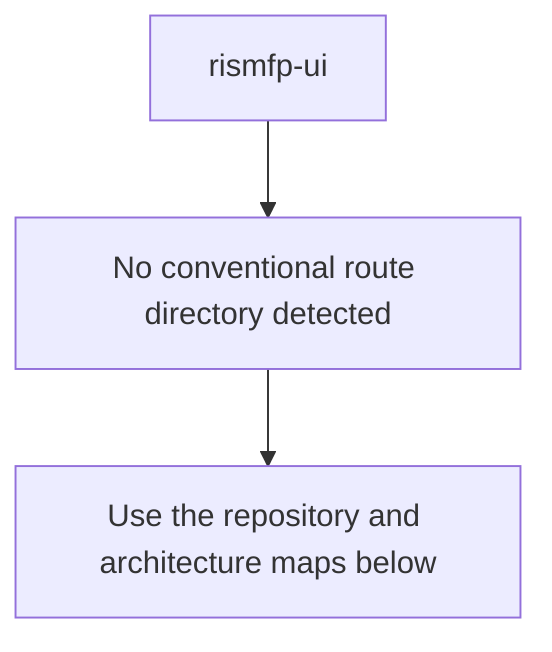
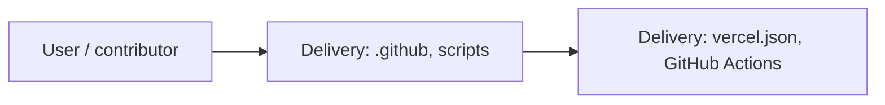
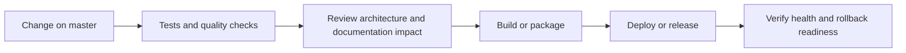

<!-- interactive-readme-standard:start -->

<div align="center">

# rismfp-ui

**Branch-aware technical guide for [`master`](https://github.com/Nischhalsubba/rismfp-ui/tree/master)**

<p>     </p>

<p>
  <a href="https://github.com/Nischhalsubba/rismfp-ui/tree/master"><strong>Browse source</strong></a> ·
  <a href="https://github.com/Nischhalsubba/rismfp-ui/issues"><strong>Issues</strong></a> ·
  <a href="https://github.com/Nischhalsubba/rismfp-ui/codespaces/new?ref=master"><strong>Open in Codespaces</strong></a>
</p>

</div>

> [!IMPORTANT]
> This guide is generated from the files actually present on `master`. It links to detected source paths, preserves project-authored notes, and avoids claiming components that were not found.

## At a glance

| Item | Detected value |
|---|---|
| Purpose | Static historical interface for the Raising Incomes of Small and Medium Farmers Project. |
| Branch role | Default branch |
| Stack | HTML, CSS, JavaScript |
| Manifests | package.json |
| Prerequisites | Node.js |
| Delivery | vercel.json, GitHub Actions |
| License | LICENSE |

## Branch scope

This is the repository's default branch.


## Quick start

```bash
npm install
```

### Configuration surface

- No committed environment example file was detected.

> Never commit secrets, private keys, production credentials, customer data, or unredacted infrastructure details.

## Repository map


```mermaid
flowchart TD
    ROOT["rismfp-ui / master"]
    ROOT --> P0[".github/"]
    ROOT --> P1["assets/"]
    ROOT --> P2["scripts/"]
    ROOT --> P3[".nojekyll"]
    ROOT --> P4["404.html"]
    ROOT --> P5["contact.html"]
    ROOT --> P6["download.html"]
    ROOT --> P7["index.html"]
    ROOT --> P8["introduction.html"]
    ROOT --> P9["LICENSE"]
    ROOT --> P10["llms.txt"]
    ROOT --> P11["news.html"]
    ROOT --> P12["package.json"]
    ROOT --> P13["robots.txt"]
    ROOT --> P14["site.webmanifest"]
    ROOT --> P15["vercel.json"]
    ROOT --> P16["web-based-mis.html"]
```

| Responsibility | Detected source paths |
|---|---|
| Delivery | [`.github`](https://github.com/Nischhalsubba/rismfp-ui/tree/master/.github), [`scripts`](https://github.com/Nischhalsubba/rismfp-ui/tree/master/scripts) |

## Website or application map


```mermaid
flowchart TD
    APP["rismfp-ui"]
    APP --> SOURCE["No conventional route directory detected"]
    SOURCE --> GUIDE["Use the repository and architecture maps below"]
```

## Architecture and responsibility flow


```mermaid
flowchart LR
    USER["User / contributor"]
    USER --> A0["Delivery: .github, scripts"]
    A0 --> DELIVERY["Delivery: vercel.json, GitHub Actions"]
```


## Quality, security, and operations

<table>
<tr>
<td width="33%" valign="top">

### Quality

- No conventional test directory was detected automatically.

Detected commands:
- No standard quality command detected.

</td>
<td width="33%" valign="top">

### Security

- No dedicated security policy or automated dependency configuration was detected.

Review authentication, authorization, input validation, dependency updates, secret handling, and failure recovery before release.

</td>
<td width="34%" valign="top">

### Observability

- No dedicated observability integration was detected automatically.

Define useful logs, metrics, traces, alerts, and rollback signals for production-facing branches.

</td>
</tr>
</table>

## Delivery flow


```mermaid
flowchart LR
    CHANGE["Change on master"] --> CHECK["Tests and quality checks"]
    CHECK --> REVIEW["Review architecture and documentation impact"]
    REVIEW --> BUILD["Build or package"]
    BUILD --> DEPLOY["Deploy or release"]
    DEPLOY --> VERIFY["Verify health and rollback readiness"]
```

### Automation detected

- [`.github/workflows/apply-interactive-readme.yml`](https://github.com/Nischhalsubba/rismfp-ui/blob/master/.github/workflows/apply-interactive-readme.yml)
- [`.github/workflows/quality.yml`](https://github.com/Nischhalsubba/rismfp-ui/blob/master/.github/workflows/quality.yml)

## Contribution flow


```mermaid
flowchart LR
    FORK["Create branch"] --> CHANGE["Make focused change"]
    CHANGE --> TEST["Run relevant checks"]
    TEST --> DOCS["Update README and diagrams"]
    DOCS --> PR["Open pull request"]
    PR --> REVIEW["Review and iterate"]
    REVIEW --> MERGE["Merge when ready"]
```

- Keep changes focused and explain architectural consequences.
- Run the checks relevant to the changed area.
- Update diagrams whenever routes, modules, data models, authentication, jobs, or delivery paths change.
- Add screenshots or recordings for visual behavior changes when useful.
- Use issues for reproducible defects and pull requests for reviewable changes.

## Ownership and support

| Topic | Source |
|---|---|
| Repository | [`Nischhalsubba/rismfp-ui`](https://github.com/Nischhalsubba/rismfp-ui) |
| Branch | [`master`](https://github.com/Nischhalsubba/rismfp-ui/tree/master) |
| Ownership | No CODEOWNERS file detected |
| Contributing | Use the contribution flow above |
| Support | [Open or review issues](https://github.com/Nischhalsubba/rismfp-ui/issues) |
| License | [`LICENSE`](https://github.com/Nischhalsubba/rismfp-ui/blob/master/LICENSE) |

<details>
<summary><strong>Documentation maintenance checklist</strong></summary>

- [ ] Purpose and branch scope are accurate.
- [ ] Setup and configuration commands still work.
- [ ] Repository, application, API, data, authentication, job, and deployment diagrams match the code.
- [ ] Tests, security controls, observability, and rollback behavior are documented.
- [ ] Links point to real files on this branch.
- [ ] No secrets or private operational details are exposed.

</details>

<!-- interactive-readme-standard:end -->

<!-- project-authored-notes:start -->
<details>
<summary><strong>Project-authored notes preserved from this branch</strong></summary>

<div align="center">


# RISMFP Historical Archive UI

A responsive, independent reconstruction of the historical **Raising Incomes of Small and Medium Farmers Project** website.

[Live site](https://nischhalsubba.github.io/rismfp-ui/) · [Source](./index.html) · [Quality checks](https://github.com/Nischhalsubba/rismfp-ui/actions/workflows/quality.yml)

</div>

> [!IMPORTANT]
> This is an unofficial historical archive and frontend case study. It is not an active Government of Nepal, RISMFP, or Asian Development Bank service.

## What the site contains

- Historical project background and intended farmer market-access approach
- Interactive Web MIS architecture with fit, zoom, pan, keyboard and fullscreen controls
- Searchable notice and document-reference archives
- Historical office records with explicit verification warnings
- Original project logo and selected field photography

## Published pages

| File | Purpose |
|---|---|
| [`index.html`](./index.html) | Archive homepage, project figures and navigation |
| [`introduction.html`](./introduction.html) | Project context, constraints, approach and intended outcomes |
| [`web-based-mis.html`](./web-based-mis.html) | Monitoring-system explanation and interactive architecture |
| [`news.html`](./news.html) | Searchable historical notice titles |
| [`download.html`](./download.html) | Searchable reports, forms, manuals and bulletin references |
| [`contact.html`](./contact.html) | Historical, unverified office details |
| [`404.html`](./404.html) | Missing-page recovery route |

## Architecture

The production site is framework-free and publishes directly from the repository root.

```text
.
├── .github/workflows/quality.yml
├── assets/
│   ├── css/
│   │   ├── style.css
│   │   ├── agri-theme.css
│   │   ├── qa-fixes.css
│   │   ├── seo-contrast.css
│   │   └── flowchart.css
│   ├── images/
│   └── js/
│       ├── qa-fixes.js
│       └── flowchart.js
├── scripts/
│   ├── validate.mjs
│   └── browser-check.mjs
├── package.json
└── seven static HTML routes
```

Headers, navigation, footers, metadata and primary content are present in static HTML. JavaScript progressively enhances the mobile menu, archive filters, project table of contents, record research actions and interactive diagram.

## Design and accessibility

The interface uses a system sans-serif stack, deep forest green, warm cream, lime accents and soft mint surfaces. Important safeguards include:

- one page-level heading per route;
- static landmarks and skip navigation;
- visible keyboard focus;
- WCAG-oriented foreground and background combinations;
- responsive layouts without intentional page overflow;
- Nepali language metadata and Devanagari fallbacks;
- reduced-motion support;
- text alternatives for the Web MIS architecture;
- historical-contact and archive-provenance warnings.

## Run locally

Serving the site requires only Python:

```bash
python -m http.server 8000
```

Open `http://localhost:8000`.

## Run quality checks

The complete QA suite uses Node.js and Playwright:

```bash
npm install
npx playwright install chromium
npm run check
```

The checks include:

- JavaScript syntax;
- required metadata and landmarks;
- local asset and route references;
- final static SEO copy;
- contrast-pair calculations;
- protection against the removed legacy controller;
- Chromium tests at desktop, tablet and mobile widths;
- horizontal-overflow detection;
- computed footer and provenance colors;
- mobile navigation bounds;
- flowchart fit and ordinary page scrolling;
- historical-contact safety.

## Deployment

GitHub Pages publishes from `master` and the repository root. Relative page and asset paths preserve support for the `/rismfp-ui/` project path. The `.nojekyll` file prevents Jekyll processing. `vercel.json` also describes the repository as a static project for preview deployments.

## Historical content and licence

Project names, figures, notices, contact details and descriptions may be outdated. Missing files are labelled unavailable rather than linked to invented downloads. Frontend source code is available under the [MIT License](./LICENSE); historical logos, photographs and project material remain attributable to their original owners.

</details>
<!-- project-authored-notes:end -->
