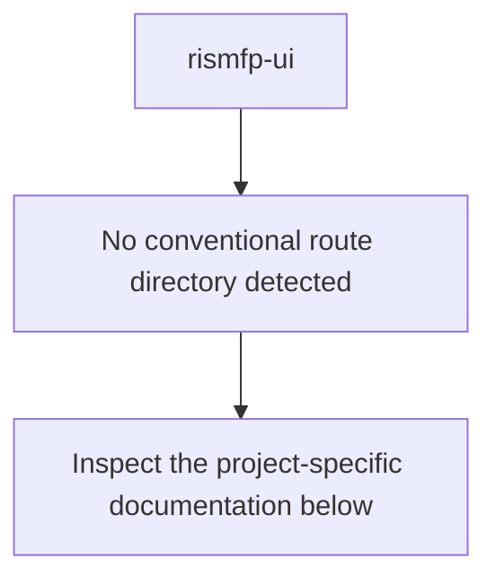
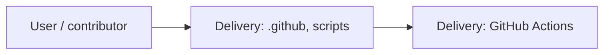
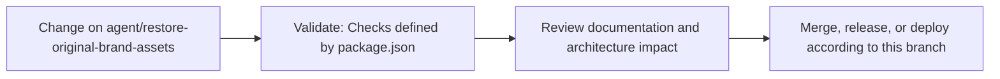

# RISMFP UI

<!-- interactive-readme-standard:start -->

> [!NOTE]
> **Branch-specific documentation:** this section is maintained for [`agent/restore-original-brand-assets`](https://github.com/Nischhalsubba/rismfp-ui/tree/agent/restore-original-brand-assets). It is generated from the files present on this branch and preserves the project-authored README below.

<details open>
<summary><strong>Interactive repository guide</strong></summary>

## Branch overview

| Item | Value |
|---|---|
| Repository | [`Nischhalsubba/rismfp-ui`](https://github.com/Nischhalsubba/rismfp-ui) |
| Branch | [`agent/restore-original-brand-assets`](https://github.com/Nischhalsubba/rismfp-ui/tree/agent/restore-original-brand-assets) |
| Detected stack | HTML, JavaScript, CSS |
| Detected manifests | package.json |
| Documentation policy | Every maintained branch must explain purpose, setup, structure, architecture, flows, testing, delivery, security, and ownership. |

## Repository structure


```mermaid
flowchart TD
    ROOT["rismfp-ui / agent/restore-original-brand-assets"]
    ROOT --> P0[".github/"]
    ROOT --> P1["assets/"]
    ROOT --> P2["scripts/"]
    ROOT --> P3[".nojekyll"]
    ROOT --> P4["404.html"]
    ROOT --> P5["contact.html"]
    ROOT --> P6["download.html"]
    ROOT --> P7["index.html"]
    ROOT --> P8["introduction.html"]
    ROOT --> P9["LICENSE"]
    ROOT --> P10["llms.txt"]
    ROOT --> P11["news.html"]
    ROOT --> P12["package.json"]
    ROOT --> P13["robots.txt"]
    ROOT --> P14["site.webmanifest"]
    ROOT --> P15["web-based-mis.html"]
```

The diagram is generated from the branch's actual top-level files and directories. Use the branch link above for complete source navigation.

## Website or application structure


```mermaid
flowchart TD
    APP["rismfp-ui"]
    APP --> SOURCE["No conventional route directory detected"]
    SOURCE --> VERIFY["Inspect the project-specific documentation below"]
```

## Application and responsibility flow


```mermaid
flowchart LR
    ACTOR["User / contributor"]
    ACTOR --> A0["Delivery: .github, scripts"]
    A0 --> DELIVERY["Delivery: GitHub Actions"]
```

## Change-to-delivery flow


```mermaid
flowchart LR
    CHANGE["Change on agent/restore-original-brand-assets"]
    CHECK["Validate: Checks defined by package.json"]
    REVIEW["Review documentation and architecture impact"]
    RELEASE["Merge, release, or deploy according to this branch"]
    CHANGE --> CHECK --> REVIEW --> RELEASE
```

## README requirements for this branch

- Explain what this branch contains and how it differs from the default branch.
- Keep installation, configuration, usage, testing, deployment, security, support, and license information accurate.
- Document repository, website or application, API, data, authentication, background-job, and deployment flows when they exist.
- Prefer Mermaid diagrams and expandable `<details>` sections for visual navigation.
- Link diagrams and modules to real source paths; never invent missing components.
- Preserve project-specific documentation and update diagrams whenever architecture or major paths change.
- Treat secrets, private infrastructure, customer data, and credentials as prohibited README content.

</details>

<!-- interactive-readme-standard:end -->

A static rebuild of the historical Raising Incomes of Small and Medium Farmers Project website.

The repository began as a 2019 frontend exercise using Bootstrap, jQuery, Gulp, Sass, Owl Carousel, and Scroll-Out. The current version keeps the project material and selected original assets while replacing the old implementation with plain HTML, CSS, and JavaScript that can be hosted directly on GitHub Pages.

> This is an independent frontend case study. It is not an official Government of Nepal, RISMFP, or Asian Development Bank service.

## What is included

- responsive pages for the project overview, web MIS, news, reports, and historical contact details;
- the original RISMFP logo and selected field photographs from the earlier repository;
- shared header and footer Web Components;
- client-side search and category filters for archived notices and reports;
- keyboard navigation, visible focus styles, semantic landmarks, and reduced-motion support;
- no build step and no runtime dependency.

## Project structure

```text
.
├── index.html
├── introduction.html
├── web-based-mis.html
├── news.html
├── download.html
├── contact.html
├── 404.html
└── assets
    ├── css/style.css
    ├── images/
    └── js/app.js
```

## Run locally

The site does not require package installation.

```bash
python -m http.server 8000
```

Open `http://localhost:8000` in a browser.

## Code comments

The HTML files include comments for the document structure and each major content section. The JavaScript file includes documentation for every function, method, and component. The CSS file is divided into labelled sections so future changes can be found without searching through compressed output.

Comments explain intent and behaviour rather than repeating obvious syntax. This keeps the source readable without filling every wrapper element with noise.

## GitHub Pages

The site is designed to publish from the repository root. Relative URLs are used for pages and assets so it works under the `/rismfp-ui/` project path.

## Historical content

Names, figures, notices, office details, and project descriptions come from the earlier repository and may be outdated. Missing report files are labelled unavailable rather than linked to placeholder URLs.

## License

The frontend code is available under the MIT License. Historical logos, photographs, names, and project material remain attributable to their original owners and are included for archival and case-study context.
