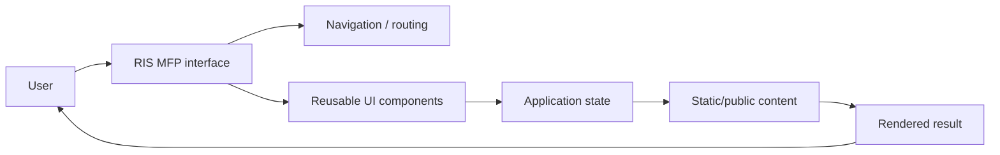
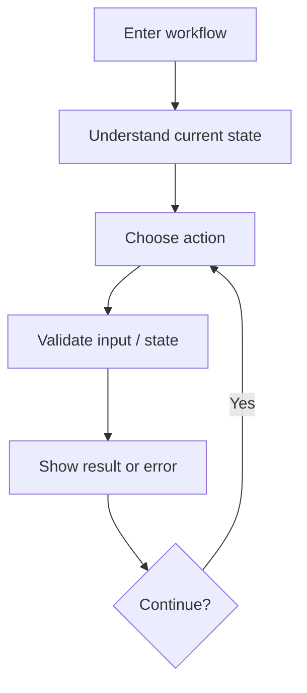
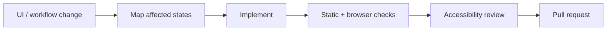

<div align="center">

# RIS MFP UI

**A maintained static historical interface for the RIS MFP public-facing experience, documented around user flows, visual states, accessibility, and maintainable front-end behavior.**


[Browse source](https://github.com/Nischhalsubba/rismfp-ui/tree/master) · [Issues](https://github.com/Nischhalsubba/rismfp-ui/issues)

</div>

## Status

This repository is maintained as a **static historical interface and public demo/documentation surface**. The deployable site lives under `site/` and is validated with static checks plus Playwright browser checks before GitHub Pages deployment.

It is not the production source of truth for authentication, private project records, payments, or server-side data. Do not place production credentials, personal records, or confidential project data in the static site.

The repository has substantial historical Git size. Normal maintenance should improve the current tree without rewriting history; history cleanup should only be undertaken as a separately reviewed migration with a backup/rollback plan.

## Overview

**RIS MFP UI** is documented as an interface system rather than a pile of screens. Developers can trace presentation and state, designers can reason about components and responsive behavior, and other reviewers can follow how a user reaches a result.

<details open>
<summary><strong>🏗️ Interactive UI architecture</strong></summary>


```mermaid
flowchart LR
    USER["User"] --> UI["RIS MFP interface"]
    UI --> NAV["Navigation / routing"]
    UI --> COMPONENTS["Reusable UI components"]
    COMPONENTS --> STATE["Application state"]
    STATE --> DATA["Static/public content"]
    DATA --> RESULT["Rendered result"]
    RESULT --> USER
```

</details>

## Interaction flow


```mermaid
flowchart TD
    START["Enter workflow"] --> ORIENT["Understand current state"] --> ACTION["Choose action"] --> VALIDATE["Validate input / state"] --> RESULT["Show result or error"] --> NEXT{"Continue?"}
    NEXT -->|Yes| ACTION
```

## Audience guide

| Audience | Focus |
|---|---|
| Users | Clear tasks, states and feedback |
| Developers | Static page structure, front-end behavior and browser tests |
| Designers | Hierarchy, interaction states, responsive behavior and accessibility |
| Product / QA | Workflow completeness, edge cases and expected outcomes |

## Getting started

```bash
git clone https://github.com/Nischhalsubba/rismfp-ui.git
cd rismfp-ui/site
npm install
npm run check
```

Use `npm run serve` to run the static site locally.

## Design & accessibility

Keep UI states explicit: loading, empty, error, success, selected, disabled and destructive states should not rely on color alone. Preserve keyboard access, focus visibility, readable density, responsive layouts and recoverable errors.

## SEO & discoverability

For public pages, use accurate RIS MFP product terminology, useful titles/descriptions, semantic headings, canonical URLs and social metadata. Historical or purely demonstrative content should be clearly labeled rather than presented as a live transactional service.

## Contribution flow


```mermaid
flowchart LR
    CHANGE["UI / workflow change"] --> STATES["Map affected states"] --> BUILD["Implement"] --> TEST["Static + browser checks"] --> ACCESS["Accessibility review"] --> PR["Pull request"]
```
