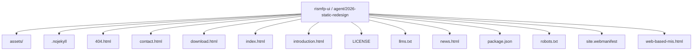
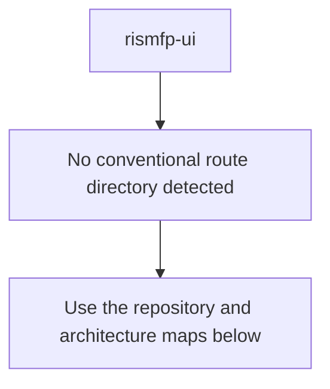
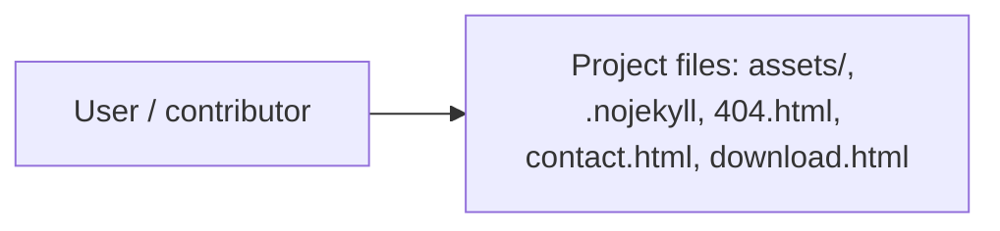
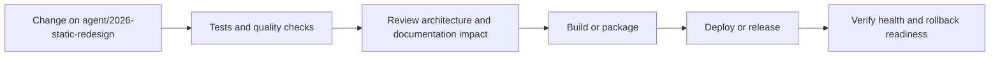
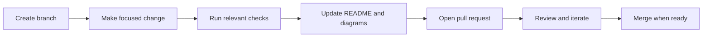

<!-- interactive-readme-standard:start -->

<div align="center">

# rismfp-ui

**Branch-aware technical guide for [`agent/2026-static-redesign`](https://github.com/Nischhalsubba/rismfp-ui/tree/agent/2026-static-redesign)**

<p>     </p>

<p>
  <a href="https://github.com/Nischhalsubba/rismfp-ui/tree/agent/2026-static-redesign"><strong>Browse source</strong></a> ·
  <a href="https://github.com/Nischhalsubba/rismfp-ui/issues"><strong>Issues</strong></a> ·
  <a href="https://github.com/Nischhalsubba/rismfp-ui/codespaces/new?ref=agent%2F2026-static-redesign"><strong>Open in Codespaces</strong></a>
</p>

</div>

> [!IMPORTANT]
> This guide is generated from the files actually present on `agent/2026-static-redesign`. It links to detected source paths, preserves project-authored notes, and avoids claiming components that were not found.

## At a glance

| Item | Detected value |
|---|---|
| Purpose | Dependency-free accessible static redesign of the historical RISMFP website. |
| Branch role | Compared with `master` |
| Stack | HTML, CSS, JavaScript |
| Manifests | package.json |
| Prerequisites | Node.js |
| Delivery | No conventional deployment configuration detected |
| License | LICENSE |

## Branch scope

This branch differs from the default branch in the following detected paths:

- [`README.md`](https://github.com/Nischhalsubba/rismfp-ui/blob/agent/2026-static-redesign/README.md)

## Quick start

```bash
npm install
```

### Configuration surface

- No committed environment example file was detected.

> Never commit secrets, private keys, production credentials, customer data, or unredacted infrastructure details.

## Repository map


```mermaid
flowchart TD
    ROOT["rismfp-ui / agent/2026-static-redesign"]
    ROOT --> P0["assets/"]
    ROOT --> P1[".nojekyll"]
    ROOT --> P2["404.html"]
    ROOT --> P3["contact.html"]
    ROOT --> P4["download.html"]
    ROOT --> P5["index.html"]
    ROOT --> P6["introduction.html"]
    ROOT --> P7["LICENSE"]
    ROOT --> P8["llms.txt"]
    ROOT --> P9["news.html"]
    ROOT --> P10["package.json"]
    ROOT --> P11["robots.txt"]
    ROOT --> P12["site.webmanifest"]
    ROOT --> P13["web-based-mis.html"]
```

| Responsibility | Detected source paths |
|---|---|
| Project files | [`assets/`](https://github.com/Nischhalsubba/rismfp-ui/tree/agent/2026-static-redesign/assets/), [`.nojekyll`](https://github.com/Nischhalsubba/rismfp-ui/blob/agent/2026-static-redesign/.nojekyll), [`404.html`](https://github.com/Nischhalsubba/rismfp-ui/blob/agent/2026-static-redesign/404.html), [`contact.html`](https://github.com/Nischhalsubba/rismfp-ui/blob/agent/2026-static-redesign/contact.html), [`download.html`](https://github.com/Nischhalsubba/rismfp-ui/blob/agent/2026-static-redesign/download.html) |

## Website or application map


```mermaid
flowchart TD
    APP["rismfp-ui"]
    APP --> SOURCE["No conventional route directory detected"]
    SOURCE --> GUIDE["Use the repository and architecture maps below"]
```

## Architecture and responsibility flow


```mermaid
flowchart LR
    USER["User / contributor"]
    USER --> A0["Project files: assets/, .nojekyll, 404.html, contact.html, download.html"]
```


## Quality, security, and operations

<table>
<tr>
<td width="33%" valign="top">

### Quality

- No conventional test directory was detected automatically.

Detected commands:
- No standard quality command detected.

</td>
<td width="33%" valign="top">

### Security

- No dedicated security policy or automated dependency configuration was detected.

Review authentication, authorization, input validation, dependency updates, secret handling, and failure recovery before release.

</td>
<td width="34%" valign="top">

### Observability

- No dedicated observability integration was detected automatically.

Define useful logs, metrics, traces, alerts, and rollback signals for production-facing branches.

</td>
</tr>
</table>

## Delivery flow


```mermaid
flowchart LR
    CHANGE["Change on agent/2026-static-redesign"] --> CHECK["Tests and quality checks"]
    CHECK --> REVIEW["Review architecture and documentation impact"]
    REVIEW --> BUILD["Build or package"]
    BUILD --> DEPLOY["Deploy or release"]
    DEPLOY --> VERIFY["Verify health and rollback readiness"]
```

### Automation detected

- No GitHub Actions workflow files were detected.

## Contribution flow


```mermaid
flowchart LR
    FORK["Create branch"] --> CHANGE["Make focused change"]
    CHANGE --> TEST["Run relevant checks"]
    TEST --> DOCS["Update README and diagrams"]
    DOCS --> PR["Open pull request"]
    PR --> REVIEW["Review and iterate"]
    REVIEW --> MERGE["Merge when ready"]
```

- Keep changes focused and explain architectural consequences.
- Run the checks relevant to the changed area.
- Update diagrams whenever routes, modules, data models, authentication, jobs, or delivery paths change.
- Add screenshots or recordings for visual behavior changes when useful.
- Use issues for reproducible defects and pull requests for reviewable changes.

## Ownership and support

| Topic | Source |
|---|---|
| Repository | [`Nischhalsubba/rismfp-ui`](https://github.com/Nischhalsubba/rismfp-ui) |
| Branch | [`agent/2026-static-redesign`](https://github.com/Nischhalsubba/rismfp-ui/tree/agent/2026-static-redesign) |
| Ownership | No CODEOWNERS file detected |
| Contributing | Use the contribution flow above |
| Support | [Open or review issues](https://github.com/Nischhalsubba/rismfp-ui/issues) |
| License | [`LICENSE`](https://github.com/Nischhalsubba/rismfp-ui/blob/agent/2026-static-redesign/LICENSE) |

<details>
<summary><strong>Documentation maintenance checklist</strong></summary>

- [ ] Purpose and branch scope are accurate.
- [ ] Setup and configuration commands still work.
- [ ] Repository, application, API, data, authentication, job, and deployment diagrams match the code.
- [ ] Tests, security controls, observability, and rollback behavior are documented.
- [ ] Links point to real files on this branch.
- [ ] No secrets or private operational details are exposed.

</details>

<!-- interactive-readme-standard:end -->

<!-- project-authored-notes:start -->
<details>
<summary><strong>Project-authored notes preserved from this branch</strong></summary>

# RISMFP UI · 2026 redesign

A dependency-free, accessible static redesign of the historical **Raising Incomes of Small and Medium Farmers Project (RISMFP)** website.

> This repository is an independent portfolio and frontend demonstration. It is not an official Government of Nepal, RISMFP, or Asian Development Bank service.

## What changed

- Replaced Bootstrap 4, jQuery, Gulp, Owl Carousel, Scroll-Out, Font Awesome, and legacy SCSS output.
- Rebuilt every public page with semantic HTML, modern CSS, and a small ES module.
- Added responsive navigation, archive search/filtering, honest unavailable-document states, accessible focus styles, reduced-motion support, and a custom 404 page.
- Preserved historical content while clearly separating it from current or official information.
- Kept deployment fully compatible with GitHub Pages.

## Architecture

```text
.
├── index.html
├── introduction.html
├── web-based-mis.html
├── news.html
├── download.html
├── contact.html
├── 404.html
└── assets
    ├── css/style.css
    └── js/app.js
```

The site uses native Web Components for the shared header and footer. Pages remain readable if JavaScript fails; filtering and mobile navigation are progressive enhancements.

## Local development

No build step is required.

```bash
python -m http.server 8000
```

Open `http://localhost:8000`.

## Deployment

GitHub Pages can publish directly from the repository root. The `.nojekyll` file prevents Jekyll processing.

## Design direction

The interface combines public-service clarity with a contemporary editorial system:

- dark agricultural green, warm neutral surfaces, and a restrained lime accent
- Manrope display typography with DM Sans body copy
- content-first hierarchy and generous spacing
- explicit archive/disclaimer messaging
- WCAG-conscious contrast, focus, semantics, and motion

## License

MIT for the code in this repository. Historical names and content remain attributable to their original organisations and are included only for archival design context.

</details>
<!-- project-authored-notes:end -->
