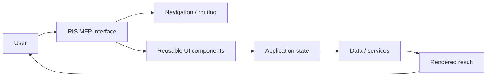
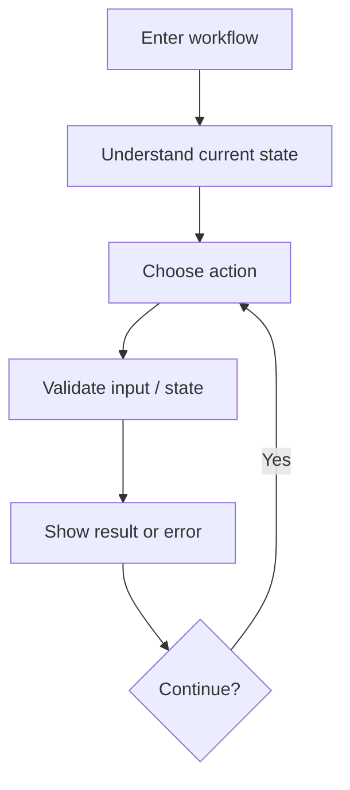
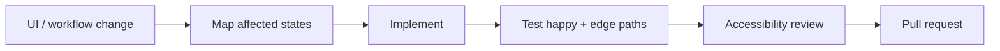

<div align="center">

# RIS MFP UI

**A UI-focused repository for the RIS MFP interface, documented around application structure, user flows, visual states, and maintainable front-end behavior.**


[Browse source](https://github.com/Nischhalsubba/rismfp-ui/tree/master) · [Issues](https://github.com/Nischhalsubba/rismfp-ui/issues)

</div>

## Overview

**RIS MFP UI** is documented as an interface system rather than a pile of screens. Developers can trace presentation and state, designers can reason about components and responsive behavior, and other reviewers can follow how a user reaches a result.

<details open>
<summary><strong>🏗️ Interactive UI architecture</strong></summary>


```mermaid
flowchart LR
    USER["User"] --> UI["RIS MFP interface"]
    UI --> NAV["Navigation / routing"]
    UI --> COMPONENTS["Reusable UI components"]
    COMPONENTS --> STATE["Application state"]
    STATE --> DATA["Data / services"]
    DATA --> RESULT["Rendered result"]
    RESULT --> USER
```

</details>

## Interaction flow


```mermaid
flowchart TD
    START["Enter workflow"] --> ORIENT["Understand current state"] --> ACTION["Choose action"] --> VALIDATE["Validate input / state"] --> RESULT["Show result or error"] --> NEXT{"Continue?"}
    NEXT -->|Yes| ACTION
```

## Audience guide

| Audience | Focus |
|---|---|
| Users | Clear tasks, states and feedback |
| Developers | Components, data/state flow, services and tests |
| Designers | Hierarchy, interaction states, responsive behavior and accessibility |
| Product / QA | Workflow completeness, edge cases and expected outcomes |

## Getting started

```bash
git clone https://github.com/Nischhalsubba/rismfp-ui.git
cd rismfp-ui
```

Use the package manager and scripts declared by the repository's manifests and lockfiles.

## Design & accessibility

Keep UI states explicit: loading, empty, error, success, selected, disabled and destructive states should not rely on color alone. Preserve keyboard access, focus visibility, readable density, responsive layouts and recoverable errors.

## SEO & discoverability

For public pages, use accurate RIS MFP product terminology, useful titles/descriptions, semantic headings, canonical URLs and social metadata. Internal application screens should prioritize task clarity and access control rather than being indexed indiscriminately.

## Contribution flow


```mermaid
flowchart LR
    CHANGE["UI / workflow change"] --> STATES["Map affected states"] --> BUILD["Implement"] --> TEST["Test happy + edge paths"] --> ACCESS["Accessibility review"] --> PR["Pull request"]
```
