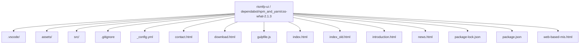
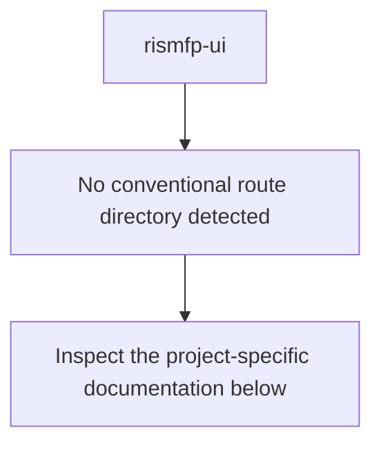
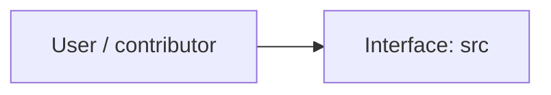
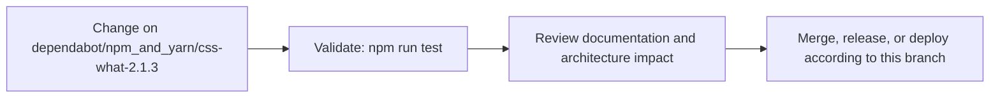

# Rismfp

<!-- interactive-readme-standard:start -->

> [!NOTE]
> **Branch-specific documentation:** this section is maintained for [`dependabot/npm_and_yarn/css-what-2.1.3`](https://github.com/Nischhalsubba/rismfp-ui/tree/dependabot/npm_and_yarn/css-what-2.1.3). It is generated from the files present on this branch and preserves the project-authored README below.

<strong>Interactive repository guide</strong>

## Branch overview

| Item | Value |
|---|---|
| Repository | [`Nischhalsubba/rismfp-ui`](https://github.com/Nischhalsubba/rismfp-ui) |
| Branch | [`dependabot/npm_and_yarn/css-what-2.1.3`](https://github.com/Nischhalsubba/rismfp-ui/tree/dependabot/npm_and_yarn/css-what-2.1.3) |
| Detected stack | Sass, JavaScript, HTML, CSS |
| Detected manifests | package.json |
| Documentation policy | Every maintained branch must explain purpose, setup, structure, architecture, flows, testing, delivery, security, and ownership. |

## Repository structure

```mermaid
flowchart TD
    ROOT["rismfp-ui / dependabot/npm_and_yarn/css-what-2.1.3"]
    ROOT --> P0[".vscode/"]
    ROOT --> P1["assets/"]
    ROOT --> P2["src/"]
    ROOT --> P3[".gitignore"]
    ROOT --> P4["_config.yml"]
    ROOT --> P5["contact.html"]
    ROOT --> P6["download.html"]
    ROOT --> P7["gulpfile.js"]
    ROOT --> P8["index.html"]
    ROOT --> P9["index_old.html"]
    ROOT --> P10["introduction.html"]
    ROOT --> P11["news.html"]
    ROOT --> P12["package-lock.json"]
    ROOT --> P13["package.json"]
    ROOT --> P14["web-based-mis.html"]
```

The diagram is generated from the branch's actual top-level files and directories. Use the branch link above for complete source navigation.

## Website or application structure

```mermaid
flowchart TD
    APP["rismfp-ui"]
    APP --> SOURCE["No conventional route directory detected"]
    SOURCE --> VERIFY["Inspect the project-specific documentation below"]
```

## Application and responsibility flow

```mermaid
flowchart LR
    ACTOR["User / contributor"]
    ACTOR --> A0["Interface: src"]
```

## Change-to-delivery flow

```mermaid
flowchart LR
    CHANGE["Change on dependabot/npm_and_yarn/css-what-2.1.3"]
    CHECK["Validate: npm run test"]
    REVIEW["Review documentation and architecture impact"]
    RELEASE["Merge, release, or deploy according to this branch"]
    CHANGE --> CHECK --> REVIEW --> RELEASE
```

## README requirements for this branch

- Explain what this branch contains and how it differs from the default branch.
- Keep installation, configuration, usage, testing, deployment, security, support, and license information accurate.
- Document repository, website or application, API, data, authentication, background-job, and deployment flows when they exist.
- Prefer Mermaid diagrams and expandable `
` sections for visual navigation.
- Link diagrams and modules to real source paths; never invent missing components.
- Preserve project-specific documentation and update diagrams whenever architecture or major paths change.
- Treat secrets, private infrastructure, customer data, and credentials as prohibited README content.

<!-- interactive-readme-standard:end -->

Whenever you commit to this repository, GitHub Pages will run [Jekyll](https://jekyllrb.com/) to rebuild the pages in your site, from the content in your Markdown files.

# What changes did i make?
Previous website: http://www.misrism.com/?q=public/home

* Implementing the modern layout with high readibility.
* Redesigning of the website to increase page load time and overall performance

## Technology Used
* Gulp for automation of the workflow.
* Owl-carousel for carousel on website.
* Scroll-Out.js for the animation.
* SCSS to make it Modular for future upgrade and Changes.

DEMO URL: https://nischhalsubba.github.io/rismfp-ui/
