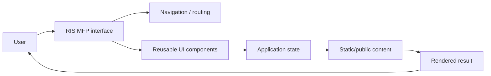
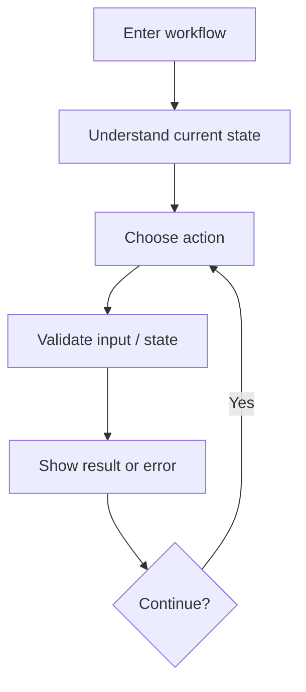

<div align="center">

# RIS MFP UI

**Frozen historical interface for the RIS MFP public-facing experience, preserved as a portfolio/demo artifact.**


[Browse source](https://github.com/Nischhalsubba/rismfp-ui/tree/master)

</div>

## Status

This repository is **historical and read-only by policy**. It is preserved as a static portfolio/demo artifact and is not an actively developed product. The deployable site lives under `site/`; the existing quality workflow remains only to protect the preserved demo from accidental breakage when repository metadata or documentation changes.

It is not the production source of truth for authentication, private project records, payments, or server-side data. Do not place production credentials, personal records, or confidential project data in the static site.

Routine feature work, dependency upgrades, redesigns, framework migrations, and Git-history rewrites are intentionally out of scope. The repository has substantial historical Git size; history cleanup would change commit SHAs and should only be attempted as an explicitly planned migration with a backup/rollback plan.

> GitHub repository archival is the intended final hosting state. Until the repository-level Archive setting is enabled by an administrator, this README is the authoritative maintenance policy: preserve the demo, do not resume normal development.

## Overview

**RIS MFP UI** is retained as an interface-system artifact rather than as a live transactional application. Reviewers can trace presentation, states, responsive behavior, and accessibility considerations without interpreting the site as current production software.

<details open>
<summary><strong>🏗️ Preserved UI architecture</strong></summary>


```mermaid
flowchart LR
    USER["User"] --> UI["RIS MFP interface"]
    UI --> NAV["Navigation / routing"]
    UI --> COMPONENTS["Reusable UI components"]
    COMPONENTS --> STATE["Application state"]
    STATE --> DATA["Static/public content"]
    DATA --> RESULT["Rendered result"]
    RESULT --> USER
```

</details>

## Interaction flow


```mermaid
flowchart TD
    START["Enter workflow"] --> ORIENT["Understand current state"] --> ACTION["Choose action"] --> VALIDATE["Validate input / state"] --> RESULT["Show result or error"] --> NEXT{"Continue?"}
    NEXT -->|Yes| ACTION
```

## Audience guide

| Audience | Focus |
|---|---|
| Users | Historical demo only; no production transactions |
| Developers | Preserved static page structure and front-end behavior |
| Designers | Hierarchy, interaction states, responsive behavior and accessibility |
| Product / QA | Historical workflow completeness and edge cases |

## Local review

```bash
git clone https://github.com/Nischhalsubba/rismfp-ui.git
cd rismfp-ui/site
npm install
npm run check
```

Use `npm run serve` to inspect the preserved static site locally.

## Preservation rules

- Keep the artifact static and free of production secrets or private data.
- Do not add live authentication, payment, personal-record, or confidential-data behavior.
- Do not perform routine dependency churn on this frozen artifact.
- Keep keyboard access, focus visibility, semantic HTML, readable density, and responsive behavior intact.
- Treat any change that alters the demo as an exceptional preservation fix requiring review and a green quality workflow.
- Do not rewrite Git history solely to reduce repository size unless a separate migration is explicitly approved.

## Security boundary

The historical site must remain public-data-only. Any future need for a live transactional product belongs in a separate actively maintained repository with its own security, deployment, data-retention, and authorization model.
