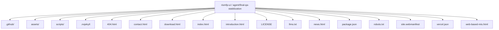
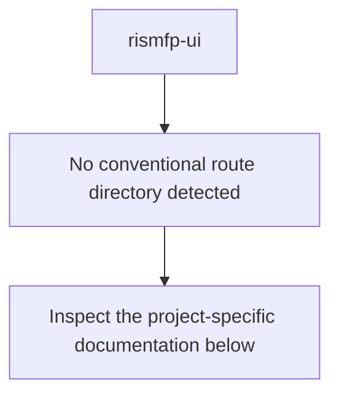
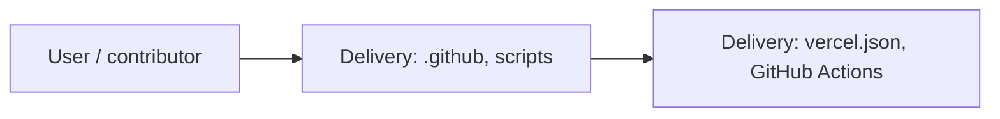
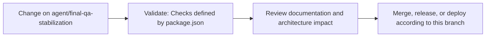

<div align="center">


# RISMFP Historical Archive UI

<!-- interactive-readme-standard:start -->

> [!NOTE]
> **Branch-specific documentation:** this section is maintained for [`agent/final-qa-stabilization`](https://github.com/Nischhalsubba/rismfp-ui/tree/agent/final-qa-stabilization). It is generated from the files present on this branch and preserves the project-authored README below.

<details open>
<summary><strong>Interactive repository guide</strong></summary>

## Branch overview

| Item | Value |
|---|---|
| Repository | [`Nischhalsubba/rismfp-ui`](https://github.com/Nischhalsubba/rismfp-ui) |
| Branch | [`agent/final-qa-stabilization`](https://github.com/Nischhalsubba/rismfp-ui/tree/agent/final-qa-stabilization) |
| Detected stack | HTML, CSS, JavaScript |
| Detected manifests | package.json |
| Documentation policy | Every maintained branch must explain purpose, setup, structure, architecture, flows, testing, delivery, security, and ownership. |

## Repository structure


```mermaid
flowchart TD
    ROOT["rismfp-ui / agent/final-qa-stabilization"]
    ROOT --> P0[".github/"]
    ROOT --> P1["assets/"]
    ROOT --> P2["scripts/"]
    ROOT --> P3[".nojekyll"]
    ROOT --> P4["404.html"]
    ROOT --> P5["contact.html"]
    ROOT --> P6["download.html"]
    ROOT --> P7["index.html"]
    ROOT --> P8["introduction.html"]
    ROOT --> P9["LICENSE"]
    ROOT --> P10["llms.txt"]
    ROOT --> P11["news.html"]
    ROOT --> P12["package.json"]
    ROOT --> P13["robots.txt"]
    ROOT --> P14["site.webmanifest"]
    ROOT --> P15["vercel.json"]
    ROOT --> P16["web-based-mis.html"]
```

The diagram is generated from the branch's actual top-level files and directories. Use the branch link above for complete source navigation.

## Website or application structure


```mermaid
flowchart TD
    APP["rismfp-ui"]
    APP --> SOURCE["No conventional route directory detected"]
    SOURCE --> VERIFY["Inspect the project-specific documentation below"]
```

## Application and responsibility flow


```mermaid
flowchart LR
    ACTOR["User / contributor"]
    ACTOR --> A0["Delivery: .github, scripts"]
    A0 --> DELIVERY["Delivery: vercel.json, GitHub Actions"]
```

## Change-to-delivery flow


```mermaid
flowchart LR
    CHANGE["Change on agent/final-qa-stabilization"]
    CHECK["Validate: Checks defined by package.json"]
    REVIEW["Review documentation and architecture impact"]
    RELEASE["Merge, release, or deploy according to this branch"]
    CHANGE --> CHECK --> REVIEW --> RELEASE
```

## README requirements for this branch

- Explain what this branch contains and how it differs from the default branch.
- Keep installation, configuration, usage, testing, deployment, security, support, and license information accurate.
- Document repository, website or application, API, data, authentication, background-job, and deployment flows when they exist.
- Prefer Mermaid diagrams and expandable `<details>` sections for visual navigation.
- Link diagrams and modules to real source paths; never invent missing components.
- Preserve project-specific documentation and update diagrams whenever architecture or major paths change.
- Treat secrets, private infrastructure, customer data, and credentials as prohibited README content.

</details>

<!-- interactive-readme-standard:end -->

A responsive, independent reconstruction of the historical **Raising Incomes of Small and Medium Farmers Project** website.

[Live site](https://nischhalsubba.github.io/rismfp-ui/) · [Source](./index.html) · [Quality checks](https://github.com/Nischhalsubba/rismfp-ui/actions/workflows/quality.yml)

</div>

> [!IMPORTANT]
> This is an unofficial historical archive and frontend case study. It is not an active Government of Nepal, RISMFP, or Asian Development Bank service.

## What the site contains

- Historical project background and intended farmer market-access approach
- Interactive Web MIS architecture with fit, zoom, pan, keyboard and fullscreen controls
- Searchable notice and document-reference archives
- Historical office records with explicit verification warnings
- Original project logo and selected field photography

## Published pages

| File | Purpose |
|---|---|
| [`index.html`](./index.html) | Archive homepage, project figures and navigation |
| [`introduction.html`](./introduction.html) | Project context, constraints, approach and intended outcomes |
| [`web-based-mis.html`](./web-based-mis.html) | Monitoring-system explanation and interactive architecture |
| [`news.html`](./news.html) | Searchable historical notice titles |
| [`download.html`](./download.html) | Searchable reports, forms, manuals and bulletin references |
| [`contact.html`](./contact.html) | Historical, unverified office details |
| [`404.html`](./404.html) | Missing-page recovery route |

## Architecture

The production site is framework-free and publishes directly from the repository root.

```text
.
├── .github/workflows/quality.yml
├── assets/
│   ├── css/
│   │   ├── style.css
│   │   ├── agri-theme.css
│   │   ├── qa-fixes.css
│   │   ├── seo-contrast.css
│   │   └── flowchart.css
│   ├── images/
│   └── js/
│       ├── qa-fixes.js
│       └── flowchart.js
├── scripts/
│   ├── validate.mjs
│   └── browser-check.mjs
├── package.json
└── seven static HTML routes
```

Headers, navigation, footers, metadata and primary content are present in static HTML. JavaScript progressively enhances the mobile menu, archive filters, project table of contents, record research actions and interactive diagram.

## Design and accessibility

The interface uses a system sans-serif stack, deep forest green, warm cream, lime accents and soft mint surfaces. Important safeguards include:

- one page-level heading per route;
- static landmarks and skip navigation;
- visible keyboard focus;
- WCAG-oriented foreground and background combinations;
- responsive layouts without intentional page overflow;
- Nepali language metadata and Devanagari fallbacks;
- reduced-motion support;
- text alternatives for the Web MIS architecture;
- historical-contact and archive-provenance warnings.

## Run locally

Serving the site requires only Python:

```bash
python -m http.server 8000
```

Open `http://localhost:8000`.

## Run quality checks

The complete QA suite uses Node.js and Playwright:

```bash
npm install
npx playwright install chromium
npm run check
```

The checks include:

- JavaScript syntax;
- required metadata and landmarks;
- local asset and route references;
- final static SEO copy;
- contrast-pair calculations;
- protection against the removed legacy controller;
- Chromium tests at desktop, tablet and mobile widths;
- horizontal-overflow detection;
- computed footer and provenance colors;
- mobile navigation bounds;
- flowchart fit and ordinary page scrolling;
- historical-contact safety.

## Deployment

GitHub Pages publishes from `master` and the repository root. Relative page and asset paths preserve support for the `/rismfp-ui/` project path. The `.nojekyll` file prevents Jekyll processing. `vercel.json` also describes the repository as a static project for preview deployments.

## Historical content and licence

Project names, figures, notices, contact details and descriptions may be outdated. Missing files are labelled unavailable rather than linked to invented downloads. Frontend source code is available under the [MIT License](./LICENSE); historical logos, photographs and project material remain attributable to their original owners.
